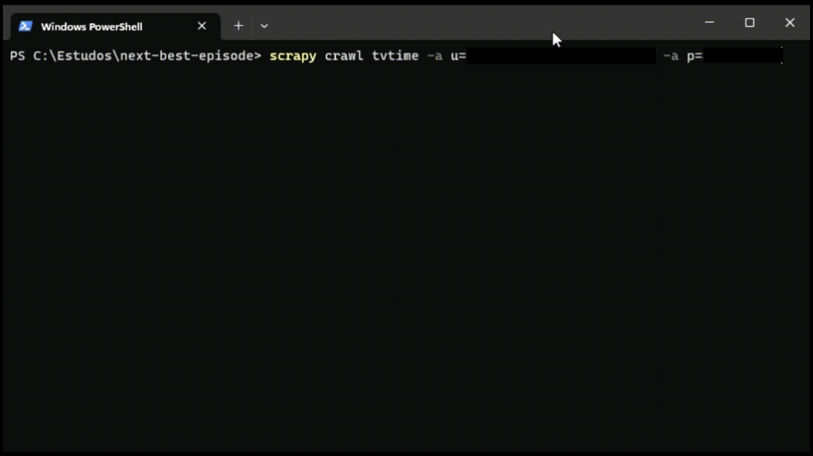

# Next best episode

A program where user can get their watchlist at TV Time (https://tvtime.com/) and sort their upcoming episodes by imdb rating, giving an idea of what are the best next episodes of their tv shows.

The web scraping part is focused on TV Time account login and getting the watchlist episodes. To get the episodes ratings we are using `cinemagoer` (https://github.com/cinemagoer/cinemagoer).

## Installation

Simply clone this repository:
```shell
$ git clone https://github.com/guilhermecxe/next-best-episode.git
```

Open the folder created:
```shell
$ cd next-best-episode
```

Create a virtual environment with `pipenv` installing the repository' dependencies:
```shell
$ pipenv install
```

## Example

Run the following command with your username and password used in TV Time:
```shell
$ scrapy crawl tvtime -a u=<username> -a p=<password>
```

My credentials were hidden below.
<div style="width: 600px">



The example is accelerated.